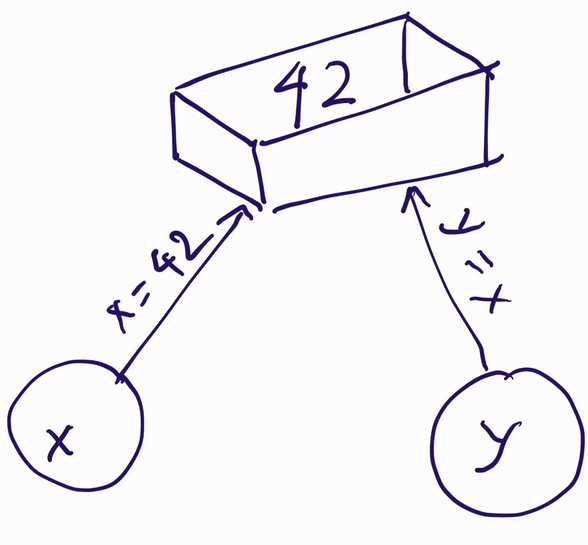

3. GitLab, control flow, list
=============================

String methods
--------------

str & unicode
-------------

Format
------

- %s %d
- Hello {}".format(name)

Name
----

- Variable
It's the hardest problem: http://pymi.vn/tutorial/naming/,
http://www.slideshare.net/pirhilton/how-to-name-things-the-hardest-problem-in-programming

Binding
~~~~~~~

Object
~~~~~~

name --binding--> object

- use id() to get "identify" of an object.
- two names bind to same object with have id(x) == id(y)
- from here, we call object with its type: int obj, str obj...

Deleting name
-------------

Before::

  ~Namespace~~~~\
  |name          \ --binding--> object
  |---------------

After::

  ~Namespace~~~~\
  |              \         object
  |---------------

And Garbage collector will collect object, remove it from memory.

Deletion of a name removes the binding of that name from the local or global
namespace, depending on whether the name occurs in a global statement in the
same code block. If the name is unbound, a NameError exception will be raised.

Control flow
------------

- if/elif/else::

  if len(username) < 8:
      print("Too short")
  elif len(username) > 20:
      print("Too verbose")
  else:
      print("Valid!")

Ternary
-------

Assign either value to a variable base on condition::

  x = 5
  is_even = True if x %2 == 0 else False
  print is_even

Error handling
--------------

try/except
Having a list of 12 months, how to handle if user enter wrong input?

Loops and iteration
-------------------

- for ... in
- while
- continue, break

Bài tập: tưởng tượng bạn đang điều khiển con rắn săn mồi bằng các lệnh.
Viết code in ra màn hình "UP" (lên) 10 lần, rồi "RIGHT" (rẽ phải) 5 lần.

Bài tập 2: dùng while, in ra màn hình số integer tăng dần từ 1. Dừng lại nếu số
nguyên đó chia cho 68 dư 1.

Introduce to git
----------------

Link to git.rst

List
----

- How to create an empty list? `L = list()` # teach this so student will not use list as var name
- List is ordered, first add, lowest index (`0`), then increases.
- How to create a list with strings?
- How to create a list with numbers?
- Given::

    numbers = [1,2,3]

  How to have first item set to 5?
- How to check is ``7`` in above list (test membership)?
- How to check if 2 list are equals?
- What happen when plus (+) two lists?
- How to add an element to a list?
- We can indexing and slice list like with string, how
  to reverse a list? It returns WHAT?
- 9 methods, built-in function ``reversed``, ``sorted``
  Each method RETURN what?
- `del list[idx]` to delete an element from list.
- Create copy of a list

Built-in Functions
------------------

https://docs.python.org/3/library/functions.html

- help
- sum
- str
- int
- bool
- all
- any
- hex, int, str, octal type
- chr
- dir
- globals()
- locals
- input
- min
- max
- ord

References
----------

- If/for https://docs.python.org/3/tutorial/controlflow.html#more-control-flow-tools
- String format https://docs.python.org/3/library/stdtypes.html#str.format
- String methods http://www.familug.org/2015/07/go-strings-package-xu-ly-string.html
- String methods https://pymi.vn/tutorial/string1/
