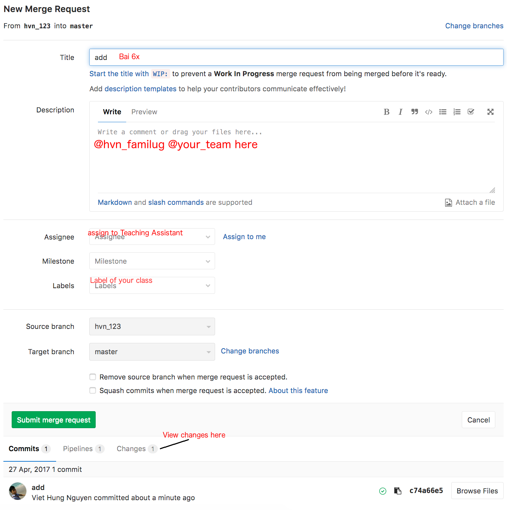
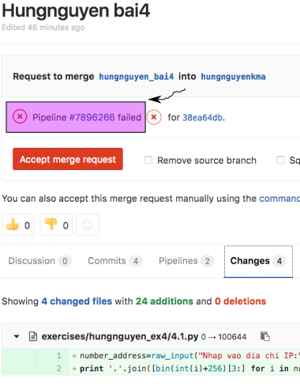

PyMi Exercises
==============

Lớp học Python3, nếu máy bạn có cả 2 phiên bản, khi chạy lệnh ``python ...``
dùng ``python3`` thay vì ``python`` để tránh dùng nhầm Python2. (Trên Windows
thường không cài sẵn python nên có thể gõ python, python3, cái nào được thì dùng,
chú ý có thể phải setup PATH, xem hướng dẫn ở đây
https://docs.python.org/3/tutorial/interpreter.html#invoking-the-interpreter)

Quy tắc chung trên Slack
------------------------

- Không chụp ảnh màn hình khi gặp vấn đề nếu có thể copy/paste text.
- Không xóa post đã được trả lời, để các bạn khác còn xem mà học tập.
- Không hỏi trực tiếp giảng viên, câu hỏi của bạn cũng có thể có lợi cho người
  khác - hãy hỏi trên channel của lớp. Nếu không liên quan tới nội dung bài
  học, hãy hỏi trên channel #python hay #chem-gio.

Hướng dẫn dùng câu lệnh trên *NIX (ubuntu, MacOS, ...)
------------------------------------------------------

- https://www.familug.org/2010/06/cmdcac-lenh-ve-thu-muc-va-tap-tin.html

- chú ý các câu lệnh trong guide này đều gõ trên Ubuntu/Mac OSX
[Terminal](http://www.familug.org/2012/03/ccgu-cli-can-ban.html#more) hoặc
Windows cmd hoặc Windows PowerShell, KHÔNG PHẢI bật Python lên rồi gõ.

Bài giảng các buổi học
----------------------

Được pin trong Slack channel của lớp học.
https://get.slack.help/hc/en-us/articles/205239997-Pin-messages-and-files

Hướng dẫn làm bài tập
---------------------

Tất cả bài tập phải làm vào trong thư mục [exercises](https://gitlab.com/pyfml/pyfml/tree/master/exercises), sửa trực tiếp nội dung của các file ``.py`` đã có tương ứng với bài tập cần làm.
Học xong chương 3 thì làm bài 'ex3_*.py' như ex3_1.py, ex3_2.py ...

Riêng ``ex35_*.py`` là bài làm thêm cho học viên từ buổi 3 đến
buổi 5. Khuyến khích dùng list comprehension.

Học viên không nên CỐ HIỂU toàn bộ các phần trong 1 bài tập ngay từ đầu,
chỉ cần tập trung vào yêu cầu của đề. Mỗi bài tập đều là 1 chương trình hoàn
chỉnh, học hết bài số 7 mới có thể hiểu hết.

Editor
^^^^^^

Cài đặt editor để mở code, sửa code, lưu code, xem tại `đây <https://gitlab.com/pyfml/prepare#c%C3%A0i-%C4%91%E1%BA%B7t-editor-sau-bu%E1%BB%95i-2->`_

Để chạy code, lớp sẽ dùng dòng lệnh (học viên tuỳ ý làm theo cách của mình và tự giải quyết nếu có vấn đề gì xảy ra).

Cách xử lý "lỗi"
^^^^^^^^^^^^^^^^

Khi chạy lệnh không thành công, vui lòng cung cấp đầy đủ câu lệnh và output,
không chỉ nói "lỗi". Trên Slack, viết code vào trong 3 dấu ` (dấu cạnh số 1
trên bàn phím) như sau::

  ```
  codehere nhớ là đã xuống dòng sau 3 dấu ` - dấu này là dấu backtick cạnh số 1, không phải single quote
  ```

Nếu code quá dài, paste code vào đây https://glot.io/
lấy link để paste vào Slack channel.

Không nên mất quá nhiều thời gian vào một khó khăn gì, nếu tự xử lý mà sau
TỐI ĐA 2 giờ đồng hồ không xong thì nên lên channel của lớp để hỏi.

**Hạn chế tối đa việc chụp ảnh màn hình và up ảnh nếu không thực sự cần thiết**

Lấy code về máy
^^^^^^^^^^^^^^^^

Cài đặt git để quản lý các file code. Xem chi tiết tại https://gitlab.com/pyfml/prepare#chu%E1%BA%A9n-b%E1%BB%8B-tr%C6%B0%E1%BB%9Bc-bu%E1%BB%95i-3

Chạy lệnh sau đây để clone (download) repo (thư mục) của lớp học về máy::

  git clone https://gitlab.com/pyfml/pyfml.git pyfml

Nếu thành công, ta sẽ thấy 1 thư mục tên pyfml tại ngay thư mục ta gõ lệnh::

  $ git clone https://gitlab.com/pyfml/pyfml.git pyfml

  HỎI USERNAME - PASSWORD thì nhập vào

  Cloning into 'pyfml'...
  remote: Enumerating objects: 7662, done.
  remote: Counting objects: 100% (7662/7662), done.
  remote: Compressing objects: 100% (3201/3201), done.
  ...
  ...
  Resolving deltas: 100% (5146/5146), done.
  Checking connectivity... done.
  $ ls pyfml/
  01_lecture.rst          gittree.png
  02_lecture.rst          guide.rst
  03_lecture.rst          index.rst
  ...

Nhập vào username (phần hiện ra khi bấm vào Profile trên GitLab, không gồm dấu @), password. Nếu dùng 2FA thì nhập [Personal Access Token](https://docs.gitlab.com/ee/user/profile/personal_access_tokens.html) vào phần password.

Mọi lệnh bắt đầu bằng chữ `git` (trừ git clone) phải chạy trong thư mục đã
clone mới có tác dụng.

Chạy 2 lệnh sau (chỉ cần làm 1 lần duy nhất) để cấu hình git::

  git config user.email hvn@familug.org # thay email của bạn vào
  git config user.name 'Viet Hung Nguyen' # thay tên của bạn vào

Các bước nộp bài
^^^^^^^^^^^^^^^^

**MỖI LẦN** làm bài tập (sau mỗi buổi học)
^^^^^^^^^^^^^^^^^^^^^^^^^^^^^^^^^^^^^^^^^^

Bước 1
^^^^^^

Vào thư mục ``pyfml``, kiểm tra branch::

  cd pyfml # chuyển đến pyfml
  git branch

Kết quả::

  * master

Nếu không thấy kết quả có ``* master``, hãy chuyển sang branch master trước::

  git checkout master

Lấy phiên bản mới nhất của branch master từ GitLab về máy::

  git pull origin master

Tạo branch mới để nộp bài::

  git checkout -b pymi_XXYYZZ_YOURNAME_lesson

Ví dụ học viên khoá 1704 Hà Nội, tên HungNV, nộp bài 3::

  git checkout -b pymi_1704HN_hungnv_bai3

**Branch này sẽ chứa tất cả bài tập của bài học đó (ở ví dụ này là bài 3),
chỉ tạo duy nhất 1 branch cho một bài học**.

Bước 2
^^^^^^

Sau đó làm bài tập và lưu vào git như sau:

Di chuyển vào thư mục chứa bài tập::

  cd exercises

Ví dụ làm bài 3.1 sẽ sửa file `ex3_1.py` bằng editor đã cài.

Nội dung của file này chứa đề bài và lời giải của bài toán.
Học viên sửa nội dung trong function solve() để trả về kết quả
phù hợp, đặt `result` bằng giá trị cần tìm. Không sửa đề bài, không sửa hàm
main, không return giá trị khác `result`.

Và chạy file này với lệnh::

  python ex3_1.py  # Trên Linux/Mac, gõ python3 để đảm bảo dùng đúng phiên bản.

Học viên cài và sử dụng
`flake8 <http://flake8.pycqa.org/en/latest/index.html#quickstart>`_
để kiểm tra code viết đúng chuẩn chưa (CHỈ BẮT BUỘC SAU BUỔI 4)::

  flake8 ex3_1.py

Nếu thấy không in ra gì tức code đã đúng chuẩn Python (PEP8) rồi 🏆

Học viên chạy lệnh sau (gõ y hệt, không cần sửa gì) tại thư mục `pyfml` để kiểm tra xem bài làm mình đã đúng
chưa (chú ý, thư mục `pyfml`, không phải `exercises`, và chắc chắn là bạn đang
dùng Python 3, không phải Python 2)::

  python3 -m unittest tests.test_ex3 -vvv

kiểm tra bài buổi 4 thì thay số 3 bằng số 4, bài 35 thì thay số 3 bằng 35 ...

hoặc lệnh sau nếu bạn thấy kết quả tương tự::

  python3 setup.py test --test-suite tests.test_ex3

Nếu đúng, output sẽ trông như sau::

  test_ex3_0 (test_ex3.TestExercise3) ... ok

Nếu có exception xảy ra hay chưa làm, kết quả sẽ như sau::

  test_ex3_0 (test_ex3.TestExercise3) ... ERROR

Nếu sai, kết quả sẽ như sau::

  test_ex3_0 (test_ex3.TestExercise3) ... FAIL

Hãy đọc chi tiết của phần output sau khi chạy câu lệnh để xem lỗi/sai gì. Kết quả khá dài, vì đây là test của tất cả các bài tập, tìm những gì mình đang làm.
Không cần quan tâm đến các bài mình chưa học.

Làm bài xong học viên lưu vào git (nhớ vào thư mục `exercises` trước khi chạy)::

  git add ex3_1.py
  git commit -m 'add - HAY NỘI DUNG TÙY Ý (e.g FIX BUG XYZ)'


Bước 3
^^^^^^

Push (đẩy) bài tập lên trang GitLab::

  git push origin YOUR_BRANCH  # CHÚ Ý, phải dùng đúng tên branch của bạn, như ví dụ này là thay YOUR_BRANCH bằng pymi_1704HN_hungnv_bai3

Nếu thấy thông báo như sau là đã thành công::

  ...
  Counting objects: 2, done.
  Delta compression using up to 8 threads.
  Compressing objects: 100% (2/2), done.
  Writing objects: 100% (2/2), 234 bytes | 0 bytes/s, done.
  Total 2 (delta 1), reused 0 (delta 0)
  remote:
  remote: To create a merge request for hvn_123, visit:
  remote:   https://gitlab.com/pyfml/pyfml/merge_requests/new?merge_request%5Bsource_branch%5D=hvn_123
  remote:
  To git@gitlab.com:pyfml/pyfml.git
   * [new branch]      hvn_123 -> hvn_123

Tiếp tục làm các bài tập khác, rồi add, commit, push.

**Chú ý: mọi thay đổi trên code đều thực hiện trên máy rồi push lên GitLab,
không chỉnh sửa online trên GitLab**

Mở đường dẫn ở trên để tạo Merge Request (MR) (hoặc làm theo hướng dẫn ở `đây <https://docs.gitlab.com/ee/gitlab-basics/add-merge-request.html>`_).
Trong phần ``Description``, @nick_người_khác để báo cho họ. Cụ thể, mọi MR phải
@hvn_familug và trợ giảng/ giảng viên của khoá.

Bấm vào ``Assignee``, chọn người sẽ review code chính cho bạn, VD trợ giảng của
khoá hoặc người cùng nhóm (sau khi đã phân nhóm).

Bấm vào ``Labels``, chọn khoá mình đang học. Nếu muốn được review bằng tiếng
Anh, chọn thêm label `EnglishReview`.



Bấm ``Submit merge request`` để tạo MR.

Sau khi bấm xong, MR của bạn đã được tạo. Chờ khoảng 5 phút để hệ thống kiểm
tra tự động (CI) kiểm tra bài tập của bạn. Nếu thấy nút X đỏ, với nội dung:



``Pipeline #ABCDEFGH failed``, tức bài tập của bạn không đạt tiêu chuẩn. Bấm vào
``#ABCDEFGH`` để xem chi tiết lỗi. Sau khi bấm vào đó, sẽ thấy một nút X đỏ cạnh
chữ ``test``, bấm tiếp vào để xem chi tiết lỗi.

Tại đây, sẽ thấy các lỗi trong code của bạn dưới dạng::

   ./4_3.py:7:80: E501 line too long (82 > 79 characters)

Tức trong file ``4_3.py``, dòng thứ 7, ký tự 80 gặp lỗi "line too long" - dòng
quá dài so với quy định cho phép tối đa là 79 ký tự.

Sửa lại file lỗi, rồi lại ``git add``, ``git commit``, ``git push``, mọi thay
đổi sẽ được đưa lên GitLab và tự động update Merge Request, học viên không
cần phải tạo Merge Request mới (chỉ tạo 1 lần duy nhất cho mỗi buổi làm bài).

Test riêng một bài
-------------------

Từ thư mục ``pyfml``, chạy::

  $ python -m unittest tests.test_ex4.TestExercise4.test_ex4_9
  E
  ======================================================================
  ERROR: test_ex4_9 (tests.test_ex4.TestExercise4)
  ----------------------------------------------------------------------
  Traceback (most recent call last):
    File "/home/hvn/me/pyfml/tests/test_ex4.py", line 207, in test_ex4_9
      self._test_all(ex4_9.solve, cases)
    File "/home/hvn/me/pyfml/tests/base.py", line 9, in _test_all
      output = func(input)
    File "/home/hvn/me/pyfml/exercises/ex4_9.py", line 12, in solve
      raise NotImplementedError("Học viên chưa làm bài này")
  NotImplementedError: Học viên chưa làm bài này

  ----------------------------------------------------------------------
  Ran 1 test in 0.000s


Debug 1 chương trình
--------------------

Thay vì chạy file python bình thường với câu lệnh::

  python filename.py

Chạy bằng câu lệnh sau để vào chế độ "debug"::

  python -m pdb filename.py

Ở đây:

- bấm ``n`` để chạy sang dòng tiếp theo (n = next)
- bấm ``l`` để hiện xem code đang ở đâu (l = list)
- gõ ``p NAME`` để in ra nội dung của tên ``NAME`` (p = print).
- gõ ``exit`` để thoát.

Ví dụ::

  $ python -m pdb foo.py
  > /home/hvn/foo.py(2)<module>()
  -> s = {"tao": 20,
  (Pdb) n
  > /home/hvn/foo.py(3)<module>()
  -> "Duy": 30,
  (Pdb) l
    1
    2  	s = {"tao": 20,
    3  ->	        "Duy": 30,
    4  	        }
    5
    6  	import logging
    7
    8  	logging.basicConfig(level=logging.DEBUG, filename='my.log')
    9  	logger = logging.getLogger('foo')
   10  	sum_  = 0
   11  	for i in ["tao", "Duy"]:
  (Pdb) n
  > /home/hvn/foo.py(6)<module>()
  -> import logging
  (Pdb) p s
  {'tao': 20, 'Duy': 30}
  (Pdb) exit


Tham khảo các lỗi hay gặp
-------------------------

XEM TRONG FILE `best_practices.rst`

:doc:`best_practices`


.. toctree::
   :caption: All Exercises Content
   :maxdepth: 2
   :glob:

   exercises/*

Bài tập làm thêm
-----------------

- Học viên PyMi yêu cầu làm tối thiểu 25 bài ProjectEuler https://projecteuler.net/
  trước khi kết thúc khóa học. Phục vụ mục đích phỏng vấn vào các công ty.
- HackerRank https://www.hackerrank.com/domains/python/py-introduction
  Học viên nên làm trên 500 điểm - phục vụ mục đích phỏng vấn vào các công ty.
- Làm thêm nếu thích: 99 Problems https://wiki.python.org/moin/ProblemSets/99%20Prolog%20Problems%20Solutions
- Làm thêm nếu thích: Python koans https://github.com/gregmalcolm/python_koans

Books, articles
===============

https://www.familug.org/2016/12/free-ebook.html

diveinpython
------------

http://www.diveintopython3.net/table-of-contents.html

Hitchhiker
----------

http://docs.python-guide.org/en/latest/

SO path
-------

http://stackoverflow.com/questions/2573135/python-progression-path-from-apprentice-to-guru?rq=1

antipatterns
------------

http://docs.quantifiedcode.com/python-code-patterns/

slot
----

https://github.com/python-diamond/Diamond/pull/256/files

become programmer
-----------------

http://norvig.com/21-days.html

become hacker
-------------

http://www.catb.org/esr/faqs/hacker-howto.html

write review on facebook
------------------------

https://www.facebook.com/pyfml/reviews

Interview questions
-------------------

- https://faq.pymi.vn/
- https://www.toptal.com/python#hiring-guide
- https://docs.python.org/3/faq/programming.html
